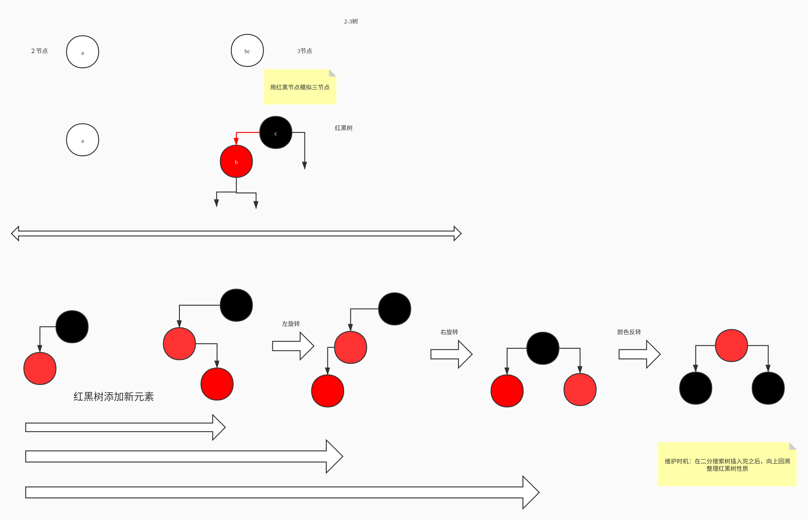

# 《玩转数据结构》 笔记

作者： bruski

时间： 2020/03/23

## 简单时间复杂度分析

大O描述的是算法的运行时间与输入数据之间的关系。

- O(1)
- O(n): 线性关系
- O(n^2)
- ...

为什么要用大O，叫做O(n)? 

大O描述的是渐进时间复杂度，即 n 趋近于无穷的情况，所以可以忽略低阶项、常数。

```
T = 2*n + 1   O(n)
T = 2000 * n + 10000   O(n)
T = 1 * n * n + 0  O(n^2)
T = 1 * n * n + 300 * n + 100  O(n^2)
```

## 02 数组

数组主要用于“索引有语义”的情况，如第几个xx。

基于Java的数组，封装Array类，增加 增删改查 功能

类内部自行维护数组与状态

- 实现头部、尾部插入，实现任意位置插入
- 支持指定位置删除、删除头部、删除尾部
- 判断是否存在元素
- 查找元素下标
- 泛型支持
    - 外部实例化, ```array<T> arr = new array<>();``
    - 内部实现 ```E[] data = (E[]) new Object[capacity]```
- 动态数组：动态开辟空间
    - 创建更大空间的数组，内部data改变引用
    - 插入元素时，如果数组满了，扩容为原来的2倍
    - 删除元素时，如果元素内存在的数量等于当前容量的1/4，就缩容回原来的一半。
    
### 数组的方法时间复杂度分析

#### 添加操作

时间复杂度： O(n)

```
addLast(e) -> O(1)                |
addFirst(e) -> O(n)               | 最坏情况：O(n)
add(index, e) -> O(n/2) = O(n)    |
```

#### 删除操作

时间复杂度： O(n)

```
removeLast(e) -> O(1)                |
removeFirst(e) -> O(n)               | 最坏情况：O(n)
remove(index, e) -> O(n/2) = O(n)    |
```

#### 修改操作

平均时间复杂度： O(n) 

已知索引(最好)： O(1)
未知索引(最坏)： O(n)

```
set(index, e) 
```

#### 查询操作

平均时间复杂度： O(n) 

已知索引(最好)： O(1)
未知索引(最坏)： O(n)

```
get(index) -> O(1)
contains(index) -> O(n)
find(index) -> O(n)
```

#### resize 时间复杂度分析

```
addLast(e) -> O(1)                | 最好情况：O(1) 最坏情况：O(n)  resize: O(n)
addFirst(e) -> O(n)               | O(n)
add(index, e) -> O(n/2) = O(n)    | O(n)
```

##### 均摊复杂度

对于addLast方法，只有超过了数组容量才会触发扩容操作

假设capacity = n, n + 1 次 addLast, 触发resize, 总共进行 2n + 1 次基本操作

用**均摊复杂度（amortized time complexity）**的概念 -> 平均每次 addLast 操作，进行 2次基本操作

则 **addLast 的均摊复杂度为 O(1)**!

##### 复杂度震荡

同时看 addLast 与 resizeLast ，在满的时候，每次操作都会触发 resize, 复杂度突增为 O(n);

因为删除的缩容resize过于着急(Eager)

解决方案: 采用更懒惰的方案Lazy： 当 size == capacity / 4 时，才将capacity减半； 同时要防止capacity缩为 0

## 03 栈与队列

栈: 数组的子集，一种后进先出 Last In First Out (LIFO)的结构，只能从一端添加，从同一端取出，这个端称为 `栈顶`。

### 栈的应用

撤销操作Undo: 原理就是用栈存储输入，撤销时最近的输入出栈。

程序调用的系统栈：用栈记录系统调用的中断位置，从而能完成函数嵌套调用。

### 复杂度分析

array.ArrayIStack<E> 基于动态数组的栈

- void push(E) -> O(1) 均摊
- E pop() ->  O(1) 均摊
- E peek() ->  O(1)
- int getSize() ->  O(1)
- boolean isEmpty() ->  O(1)

### 算法题：括号匹配

需要判断一组符号是否正确匹配且闭合 如

```
() -> true
{(]} -> false
```

思路： 使用栈结构，遍历输入的字符串，逐一取字符，如果是左括号`([{` 入栈，直到遇到右括号 `)]}` 出栈比对：

- 如果遇到左括号而栈里为空，说明不是左括号打头，不构成包裹，返回false；
- 如果括号类型不匹配，返回false；
- 否则继续遍历；

如果遍历结束：

- 栈里还不为空，说明没匹配完，返回false；
- 否则，说明匹配成功，返回true

### 3-5 队列

队列 FIFO 先进先出

接口
```
public interface queue.Queue<E> {
    int getSize();

    boolean isEmpty();

    void enqueue(E e);

    E dequeue();

    E getFront();
}
```

#### 数组队列

```
public public class queue.ArrayQueue<E> implements queue.Queue<E> {
    int getSize(); // 时间复杂度: O(1)

    boolean isEmpty(); // 时间复杂度: O(1)

    void enqueue(E e); // 时间复杂度 O(1) 均摊

    E dequeue(); // 时间复杂度： O(n)

    E getFront(); // 时间复杂度 O(1)
}
```

数组队列出队的问题：

删除队首的元素，元素前移，时间复杂度为O(n)

#### 循环队列

解决出队复杂度为 O(n) 的问题, 由于删除队首后,仍保持着队列的性质. 用循环队列解决, 使得出队的时间复杂度为 O(1)

基于数组，维护 front 和 tail 指针

- front == tail 队列为空
- (tail + 1) % size == front 队列满

因为队列满和队列空条件要区别，所以会浪费一个空间

```
public class queue.LoopQueue<E> implements queue.Queue<E> {
    int getSize(); // 时间复杂度: O(1)

    boolean isEmpty(); // 时间复杂度: O(1)

    void enqueue(E e); // 时间复杂度 O(1) 均摊

    E dequeue(); // 时间复杂度： O(1)均摊 // 根据 front 指针直接取

    E getFront(); // 时间复杂度 O(1)
}
```

#### 数组队列与循环队列

100000次出队操作, 循环队列 26s 数组队列 0.1s

## 04 链表

动态数据结构，不支持随机访问，不适合索引有语义的情况

```
class Node {
    E e;
    Node next;
}
```

### 链表的新增数据

- 从链表头部添加数据
- 在链表中间添加元素: 关键找到要添加节点的前一个节点，顺序很重要

### 只使用真实头节点的实现

只设立真实头节点，在插入头的时候，需要单独处理

### 使用虚拟头结点的实现

头结点不存储数据，用于指示位置,(占用一个空间),但是对于寻找前一个节点非常方便.

### 链表中的删除

找到待删除节点的前一个节点， prev

将prev的next指向要删除节点的Next：

```
target = prev.next;
prev.next = target.next;
target.next = null;
```

> 补充删除链表节点的办法
> 在要删除的节点处，拷贝后一个节点的值，然后链接到下下个节点处
> ```
> target.val = target.next.val;
> target.next = target.next.next;
> ```

### 时间复杂度

添加操作 O(n)

- addLast(e) O(n)
- addFirst(e) O(1)
- add(index, e) O(n/2) = O(n)

删除操作 O(n)

- removeLast(e) O(n)
- removeFirst(e) O(1)
- remove(index, e) O(n/2) = O(n)

修改操作 O(n)

- set(index, e);

查找操作 O(n)

- get(index)  O(n)
- contains(e)  O(n)

总结，只对链表头操作，就可以达到 O(1) 复杂度；且动态不占内存

### 数组栈 VS 链表栈

时间复杂度相同，都是O(1)，但链表栈的new操作耗时

### 数组队列 VS 链表队列

数组队列 O(n^2) 链表队列 O(1)

## 05 递归

本质上，将原来的问题，转化为更小的同一问题

### 递归写法

1. 求解最基本问题
2. 将原问题拆解为更小的问题
3. 返回递归结果

### 链表与递归

#### 例子：删除所有值为特定值的节点

将链表看成 头结点 + 剩余部分

如果头结点为要删除的值，则返回处理后的剩余部分
否则 返回 头结点 + 处理后的剩余部分

近乎和链表的所有操作，都可以使用递归的形式完成

对链表的增删盖茶进行递归实现

### 5-5 递归运行的机制：微观解读

程序调用的系统栈

递归调用有代价：函数调用+系统栈空间

### 双链表

每个节点，都有两个指针

```
class Node {
    E e;
    Node next, prev;
}
```

### 循环链表

增加虚拟头结点的双向链表

### 数组链表

```
class Node {
    E e;
    int next;
}
```

## 06 二分搜索树

属于二叉树的一种，每个节点有左儿子与右儿子，其中每个节点的左子树都小于当前节点的值，右子树都大于当前节点的值。

不包含重复元素。

### 插入元素

递归操作：对当前根节点进行插入

如果当前传入节点为null，将传入的值创建新节点，返回。
否则 如果要插入的值小于当前节点值，递归左子树，返回递归结果
如果要插入的值大于当前节点值，递归右子树，返回递归结果
如果相等，什么都不做。

### 遍历操作

就是把所有节点都访问一遍。

递归操作。

### 前序遍历（深度优先）

先访问节点，再访问左子树、右子树。

```
function traverse(node):
    if (node == null)
        return;

    print(node);
    traverse(node.left);
    traverse(node.right);
```

#### 非递归实现

利用栈结构，记录要按前序访问的节点，通过后进先出，实现左右子树的前序遍历。

### 中序遍历（深度优先）

先访问左子树，再访问节点、右子树。

**中序遍历的结果：顺序排序**

```
function traverse(node):
    if (node == null)
        return;

    traverse(node.left);
    print(node);
    traverse(node.right);
```

### 后序遍历（深度优先）

先访问左子树，再右子树、访问节点。

**应用：后序遍历为二分搜索数释放内存**

```
function traverse(node):
    if (node == null)
        return;

    traverse(node.left);
    print(node);
    traverse(node.right);
```


### 层序遍历（广度优先）

利用队列，在每个节点遍历时，将左右子节点入队，实现层级的遍历

### 删除二叉搜索数最大最小元素

最小元素：一直往左子树走，最左的节点

最大元素：一直往右子树走，最右的节点

### 删除任意值所在的节点

判断删除的值比当前节点大、小或相等，

- 小： 递归左子树
- 大： 递归右子树

找到要删除的节点

- 如果当前节点左子树为空：删除后将当前节点右子树返回
- 如果当前节点右子树为空：删除后将当前节点左子树返回
- 如果当前节点左右子树不为空：
    - 有两种方式：找到当前点的前驱点（即左子树的最右节点）或后继点（即右子树的最左节点），都能保证二叉搜索数的性质
    - 后继节点法：
        - 找到当前节点的后继节点（即右子树的最小值节点），在右子树中删除该后继节点，返回该后继节点
        - 将后继节点的左指针指向将当前节点的左子树
        - 将后继节点的右指针指向将当前节点的删除了后继节点的右子树
    - 返回后继节点
    
### 二分搜索树的顺序性

floot / ceil

rank 排名

select

维护size的二分搜索树

维护depth的二分搜索树

支持重复元素的二分搜索树 维护count或插入左子树

## 07 集合 Set

二分搜索树不存放重复元素，是实现集合的好结构。

典型应用：客户统计、词汇量统计

### 二分搜索树实现

### 链表实现

### 复杂度分析

二分搜索树可能退化成链表

#### LinkedListSet

增 add - O(n)

查 contains - O(n)

删 remove - O(n)

#### BSTSet

平均 O(logn)

最差 O(n) (退化成链表,此时h=n) 

设树的高度为 h

增 add - O(h)

查 contains - O(h)

删 remove - O(h)

##### 高度与节点数关系

满二叉树： `第h-1层： n = 2 ^ (h - 1)`

h层一共： `2^0 + 2^1 + ... + 2^(h-1) = 2^h - 1 个`

`h = log2(n+1) -> O(log(n))`

log(n) 与 n： n越大, 差距越大

#### 有序集合和无序集合

有序集合：基于搜索树的实现

无序集合：基于哈希表的实现

## 07 映射 Map

- 链表Map
- 二分搜索树Map

### 时间复杂度分析

|操作|LinkedListMap|BSTMap|
|:--:|:--:|:--:|
|增add|O(n)|O(h)|
|删remove|O(n)|O(h)|
|改set|O(n)|O(h)|
|查get|O(n)|O(h)|
|查contains|O(n)|O(h)|
|平均|O(logn)|O(n)|

### 有序映射 VS 无序映射

### 多重映射

## 08 堆与优先队列

优先队列：出队时返回优先级最大的元素

### 实现

#### 普通线性结构

入队：O(1)
出队：O(n)

#### 顺序线性结构

入队：O(n)
出队：O(1)

#### 堆

最坏情况： 

入队：O(logn)
出队：O(logn)

### 二叉堆（Binary Heap）

二叉堆是一颗完全二叉树，堆中的某个节点总是不（大于/小于）其父节点的值

最大堆、最小堆

#### 完全二叉树

不一定是满二叉树，把元素按层从左到右存放节点，即完全二叉树

#### 用数组存储二叉堆

从下标 1 开始存储，存在以下关系：

```
parent(i) = i / 2 // 向下取整
left child(i) = 2 * i
right child(i) = 2 * i + 1
```

从下标 0 开始存储，存在以下关系：

```
parent(i) = (i - 1) / 2 // 向下取整
left child(i) = 2 * i + 1
right child(i) = 2 * i + 2
```

#### 插入节点

以最大二叉堆为例子：

上浮操作：

将插入的位置，与其父节点作比较，若父节点小于插入元素，交换位置，直到上浮到根节点。

下沉操作：

与其子节点中最大一个比较，若当前节点小于其最大子节点，则交换位置，直到叶节点位置。

#### Replace 取出最大元素，再放入一个新元素

思路1：先extracMax，再add，两次O(logn)的操作

思路2：先将堆顶元素替换，然后执行Sift down，一次O(logn)的操作

#### Heapify 将一个数组变成堆

思路1：往空堆中一个个插入 算法复杂度 O(nlogn)

思路2： 将数组看成一颗完全二叉树，找到最后一个非叶子节点的下标往前遍历，对每个节点执行下沉操作; 算法复杂度 O(n)

最后一个非叶子节点下标： 最后一个元素的下标 i / 2 向下取整

### 优先队列

使用最大堆来实现，实现Queue的接口

``` 
public interface Queue<E> {
    int getSize();

    boolean isEmpty();

    void enqueue(E e);

    E dequeue();

    E getFront();
}

```

入队即最大堆的`add`, getFront即最大堆的`findMax`, 出队即最大堆的`extractMax` 

#### 经典问题

在1,000,000个元素中选出前100名：即在N个元素中选出前M个元素

- 使用排序：NlogN
- 使用优先队列：NlogM

思路：使用优先队列，维护当前看到的前M个元素 -> 需要使用最小堆

最大堆 -> 最小堆？ 定制比较逻辑，定义什么是优先级：值越小，优先级越高。


## 09 线段树

线段树是平衡二叉树，不是完全二叉树

### 应用场景：区间查询

查询某个区间里的合并值，非常适合会动态更新的区间

时间复杂度 `O(m * logn)`

空间复杂度 `O(4n)`

**如果区间有 n 个元素，数组表示需要有多少节点？**

对满二叉树中，h层，一共有 `2^h - 1` 个元素

- 如果 `n = 2^k` 时，只需要2n的空间
- 最坏情况 如果 `2^k+1` , 需要4n的空间

我们的线段树不考虑新增元素，使用 4n 的静态空间即可。

### 基于求和为例，创建线段树

指定在哪个下标开始，创建从l到r的区间的合并结果。

## 10 Trie 树

案例： 老旧设备的芯片运算低，通讯录搜索慢的问题，采用Trie数据结构解决

应用：处理字符串

字典：如果有n个条目，使用树结构，查询的实践复杂度位 O(logn)

Trie: 

查询的每个条目的时间复杂度，与查询的字符长度有关，和字典中一共有多少数据无关;

数据结构：

```
class Node {
    boolean isWord;
    Map<char, Node> next;
}
```

### 新增

将新增的单词拆解成字符，沿着根目录找next的map中是否有该单词，没有的话创建，有的话顺延到下一个Next.

如果到末尾, 节点的isWord为true, 说明已经存了这个单词; 否则, 置isWord为 true, size ++;

### 查询

将新增的单词拆解成字符，沿着根目录找next的map中是否有该单词，没有的话返回false，有的话顺延到下一个Next.

循环结束，返回节点的 isWord


### Trie相关的话题

Trie的删除操作

局限性：空间

压缩字典树 Compressed Trie

Ternary Search Trie：三分搜索树

后缀树：字符串模式识别

子串查询：KMP, Boyer-Moore, Rabin_Karp算法

文件压缩

编译原理

生物科学：DNA

## 11 并查集　Union Find

解决 **连接问题**: 网络中节点的连接状态

数学中的集合类实现

连接问题和路径问题

回答是否有连接，用并查集更高效

主要支持两个动作

- union(p, q)
- isConnected(p, q)

### Quick Find

基本数据表示

```
0 1 2 3 4 5 6 7 8 9  (元素)
--------------------
0 1 0 1 0 1 0 1 0 1  (集合id值)
```

查询复杂度：O(1)

Union复杂度: O(n)

### Quick Union

初始化，森林，指向自己的id

```
parent
0 1 2 3 4 5 6 7 8 9  (元素)
--------------------
0 1 2 3 4 5 6 7 8 9  (id)
```

查询复杂度：O(h)

Union复杂度: O(h)

### 优化　unionElements 操作

如果不考虑合并的节点大小，容易导致树的高度越来越高：

解决方案，使节点大小更小的连接到大的祖先节点，使树的高度减小

### 基于 rank 的优化

节点合并时, 基于节点的高度，将高度小的指向高度大的，整体树高度就会更小

### 路径压缩

查找的过程中，顺便做提父亲的操作

```
parent[i] = parent[parent[i]]
```

### 加强办路径压缩

在查询时，用递归直接将该条路径的所有节点都指向根节点，压缩树的高度

严格意义上: O(log*n) iterated logarithm  近乎O(１) 级别

```
log*n = 0 , if(n<=1)
      = 1 + log*(logn) if(n>1)
```

## 12 AVL 树

G.M.Adelson-Velsky & E. M. Landis

**平衡二叉树**: 对于任意一个节点，左子树 和 右子树的高度差不能超过1

**满二叉树**: 是平衡二叉树，树的高度最低，除了叶子节点，其他节点都有左右子树

**完全二叉树**：从左至右铺开二叉树

平衡二叉数的高度和节点数量之间的关系也是　**O(logn)**

标注节点高度，计算平衡因子(左右子树高度差)

### BST二分搜索树 转为 AVL树

AVL树是一颗平衡二叉树,　可以在BST树的基础上实现。

节点需要添加：

- height: 表明该节点的高度(左右子数最大的那个高度), 叶子节点的高度为１，null节点高度为0

树方法添加:

- getHeight
- getBalancedFactor　获取平衡因子(左子树高度-右子树高度)
- isBalanced　递归的判断节点的平衡因子，需满足所有节点的平衡因子都小于等于１才叫做整棵树是平衡的
- isBST　判断该树是否为二分搜索树，即看中序遍历后的数组是否位升序数组

### AVL树的左旋转和右旋转

#### LL  插入节点在不平衡节点的左孩子的左侧

执行右旋转

```
// 对节点y进行向右旋转操作, 返回旋转后新的根节点 x
//       y                                x
//      / \                             /   \
//     x   T4       向右旋转（y）       z      y
//    / \        - - - - -- - - ->   / \    / \
//   z   T3                         T1  T2 T3  T4
//  / \
// T1  T2
```

```
x.right = y;
y.left = T3;
```

#### RR 插入节点在不平衡节点的右孩子的右侧

执行左旋转

```
// 对节点y进行向左旋转操作, 返回旋转后新的根节点 x
//       y                                   x
//      / \                                 /  \
//     T4 　x      　　　向左旋转（y）        y     z
//    　　　/ \        - - - - -- - - ->   / \   / \
//   　　　T3 　z                         T4  T3 T1 T2
//  　　　　　　/ \
// 　　　　　　T1  T2　
```

```
x.left = y;
y.right = T3;
```

#### LR 插入节点在不平衡节点的左孩子的右侧

先对 x　节点进行　左旋转 转为 LL

```
// 对节点y进行向右旋转操作, 返回旋转后新的根节点 x
//       y                                     y
//      / \                                  /   \
//     x   T4    对y的左孩子x做左旋转转成LL     z     T4
//    / \        - - - - -- - - ->         / \    
//   T1   z                               x  T3 
//       / \                             / \
//      T2  T3                          T1  T2 
```

再对y执行　右旋转, 完成平衡操作

```
// 对节点y进行向右旋转操作, 返回旋转后新的根节点 x
//       y                                x
//      / \                             /   \
//     x   T4       向右旋转（y）       z      y
//    / \        - - - - -- - - ->   / \    / \
//   z   T3                         T1  T2 T3  T4
//  / \
// T1  T2
```

#### RL 插入节点在不平衡节点的右孩子的左侧

先对 x　节点进行　右旋转 转为 RR, 再对y执行　左旋转

### AVLTree　应用

基于 AVLTree 实现　Map, Set

### AVLTree复杂度

在最差的情况下，增删改查全是 O(log(n))

### AVL优化

如果一个节点重新计算的高度没变, 那么其父亲以上的节点都不用更新高度了

红黑树平均性能比　AVLTree　性能更好

第一个自平衡的树

## 13 红黑树

《算法导论》定义：

1. 每个节点或者是红色的，或者是黑色的
2. 根节点是黑色的
3. 每一个叶子节点(最后的空节点)是黑色的
4. 如果一个节点是红色的，那么它的孩子节点都是黑色的
5. 从任意一个节点到叶子节点，经过的黑色节点是一样的

Robert Sedgewick 红黑树发明人

Donald Knuth 现代计算机科学的前驱

红黑树与 2-3 树是等价的

### 2-3树

满足二分搜索树的基本型值

节点可以存放一个元素或两个节点，有２－３个字节点

2-3树是一棵绝对平衡的树：对于任意一个节点，左右子树的高度是相等;节点可以存1-2个元素

#### 添加节点

不会插入空节点, 只会跟最后的叶子节点做融合, 如果该节点添加完是四节点，会拆解成３个二节点的子树。

如果插入3-节点，其父亲为２-节点：插入3节点形成临时４节点，拆成３个２节点，再将中间节点与父节点做融合

如果插入3-节点，其父亲为３-节点：插入3节点形成临时４节点，拆成３个２节点，再将中间节点与父节点做融合; 对父节点递归上边的拆解。

### 红黑树

每个节点只存一个值

用红黑节点表示2-3节点的3节点

红黑树是保持“黑平衡”的二叉树

严格意义上，不是平衡二叉树，最大高度 2logn => O(logn)

#### 添加新元素

或者添加到2-节点，形成3-节点

或者添加到3-节点, 暂时形成4-节点

永远添加红色节点



#### 红黑树做Map性能分析

1. 数据集不大，用简单数据结构占有
2. 红黑树不是严格平衡树, 2logn, 比avl高，查询不占优;真正占优的是在新增、删除
3. 添加操作还有优化余地

### BST与AVL与BST对比

对于完全随机的数据, 普通的二分搜索树很好用！缺点: 极端情况退化成链表　(或者高度不平衡)

对于查询较多的使用情况, AVL树很好用

红黑树牺牲了平衡性(2logn的　高度) 统计性能更优(综合增删改查所有操作)

### 更多红黑树的话题

删除的逻辑复杂, 不涉及

本质：黑平衡的二分搜索树，牺牲了平衡性，统计性能优，在新增/删除更优

红黑树统计性能更优：其他Splay Tree(伸展树), 局部性原理: 刚被访问的内容下次高概率被再次访问


## 14 哈希表

哈希函数:键转换为索引

f(ch) = ch - 'a'

一个半的学生学号: 1-30

身份证号, 字符串, 浮点数, 日期

很难做到每个键通过哈希函数的转换,对应不同的"索引" -> 哈希冲突 -> 哈希表(空间换时间)

哈希表的是时间和空间之间的平衡

哈希函数的设计是很重要的

### 哈希函数的设计

最通用的哈希函数: 转成整型处理

小范围的正整数,直接使用

小范围的扶正树进行偏移

#### 大整数

通常做法 取模; 容易分布不均匀

简单解决办法: 模一个素数, 得到哈希值分布更均匀

#### 浮点型 

在 其表示 32位 / 64位 的数据按整型解析,再取模完成映射.

#### 字符串

转成整型处理

hashtable(code) = (c * B^3 + o ^ B^2 + d * B^1 + e * B^0) % M
           = ((((c % M) * B + o) % M * B + d)  % M * B + e) % M

#### 复合类型

Date: year, month, day

#### 原则

1. 一致性: 如果a==b, 则hash(a) == hashtable(b)
2. 高效性: 计算高效简便
3. 均匀性:哈希值均匀分布

#### 哈希冲突的处理: 链地址法

Seperate Chaining

```
(hasCode(k1) & 0x7fffffff) % M
```

按位与操作将32位整型的符号位置 0, 即取绝对值

HashMap 是一个 TreeMap 数组

HashSet 是一个 TreeSet 数组

Java8 每个位置对应一个链表, 当哈希冲突达到一定程度,转为红黑树

#### 时间复杂度

总共有 M 个地址, 如果放入哈希表的元素为 N, 如果每个地址是链表: O(N/M), 如果每个地址是平衡树: O(log(N/M))

如何达到 O(1)? 设计 resize 方法使 M 是动态的, 实现数组动态扩缩容量

平均每个地址承载的元素多过一定程度, 即扩容

```
N / M >= upperTol
```

平均每个地址承载的元素少过一定程度, 即缩容

```
N / M < upperTol
```

均摊复杂度: O(1): 每个操作在 O(lowerTol) ~ O(upperTol) 之间的, -> O(1)

扩缩容要选择的素数,可以根据实验得出的数据设置:

```
int[] capacity = {53, 97, 193, 389, 769, 1543, 3079, 6151, 12289, 24593,
        49157, 98317, 196613, 393241, 786433, 1572869, 3145739, 6291469,
        12582917, 25165843, 50331653, 100663319, 201326611, 402653189, 805306457, 1610612741};
```

#### 哈希表分析

哈希表: 均摊复杂度位O(1)

牺牲了什么? 顺序性

集合, 映射:

- 平衡树: 有序的集合, 有序映射
- 哈希表: 无序集合, 无序映射


// Bug: 底层是 TreeMap, K 要求是可比较的, 若传入不可比较的类型回报错
// 解决方案:学习Java8的实现,冲突小时采用链表,冲突大时,检查键是否可比较,如果是,则转为红黑树

#### 开放地址法 Open Addressing

地址不存表,直接存数据, 按hash的值查找, 执行探测

线性探测: 如果被占据了,直接找下一个地址 +1

平方探测法: 先加1尝试, 如被占了, + 2 ^ 2; + 3^2 ; + 4^2

二次哈希法: + hash2(key)

负载率: 扩缩容指标, 存放的元素树占数组的50%以上

#### 更多哈希冲突

再哈希法 Rehashing

Colaesced Hashing: 综合了 Seperate Chaining 和 Open Addressing

## 课程总结

```
线性结构: 动态数组, 普通队列, 栈, 链表, 哈希表

树形结构: 二分搜索树 AVL树 红黑树
        堆, 线段树
        多叉树: Trie, 并查集

图结构: 邻接表, 邻接矩阵
```

更多的是抽象数据结构, 而非具体实现:

线性表: 用动态数组; 链表实现

栈, 队列

集合, 映射

- 有序集合, 有序映射
- 无序集合, 无序映射

更多数据结构:

双端队列: 随机队列,最大最小队列

双向链表;循环链表;跳跃表;后缀数组

K-D树, Splay树, B树